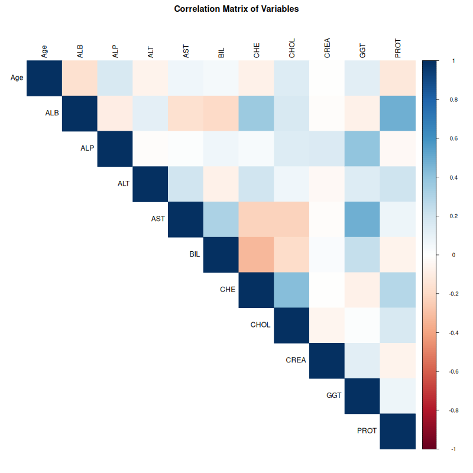

# 1. Introduction

## 1.1 Project Overview

This project presents a comprehensive analysis of the Hepatitis C
dataset, exploring clinical variables to understand disease patterns and
develop predictive models. The analysis follows a data science workflow
from initial exploration through advanced modeling.

## 1.2 Research Questions

The analysis addresses several key questions:

1.  **Data Quality**: What is the structure and quality of the dataset?
    Are there missing values or anomalies?
2.  **Feature Relationships**: How do different clinical markers
    correlate with each other?
3.  **Dimensionality**: Can we reduce the feature space while preserving
    important information?
4.  **Prediction**: Can we build accurate models to classify Hepatitis C
    categories?
5.  **Feature Importance**: Which clinical markers are most important
    for prediction?

# 2. Initial Data Exploration

## 2.1 Loading Libraries and Data

```{r load-packages}
# Load all required libraries
library(tidyverse)    # Data manipulation & plotting
library(corrplot)     # Correlation matrices
library(naniar)       # Missing value visualization
library(GGally)       # Pair plots
library(factoextra)   # PCA visualization
library(caret)        # Machine learning workflow
library(glmnet)       # Lasso/Ridge regression
library(pROC)         # ROC curves
library(randomForest) # Random Forest model
library(MASS)         # LDA model
library(reshape2)     # Data reshaping

# Set plotting theme
theme_set(theme_minimal(base_size = 12))
```

```{r load-data}
# Load the dataset
data <- read.csv("data/hcvdat0.csv")  

head(data)
```

## 2.2 Understanding the Data Structure

```{r}
str(data)
```

```{r}
dim(data)
```

```{r}
summary(data)
```

**Initial Observations:** - This dataset contains 615 rows and 14
columns - Most of the variables are clinical variable - Need to check
for missing values

# 3. Data Quality Assessment

## 3.1 Missing Values Analysis

```{r}
colSums(is.na(data))

```

```{r}
missing_by_category <- data %>%
  group_by(Category) %>%
  summarise(
    n_total = n(),
    n_with_missing = sum(rowSums(is.na(across(Age:PROT))) > 0),
    pct_missing = round(n_with_missing / n_total * 100, 1),
    ALB_missing = sum(is.na(ALB)),
    ALP_missing = sum(is.na(ALP)),
    ALT_missing = sum(is.na(ALT)),
    CHOL_missing = sum(is.na(CHOL)),
    PROT_missing = sum(is.na(PROT)),
    
    # for the columns only have one missing value
    single_missing = sum(rowSums(is.na(across(Age:PROT))) == 1),
    # for the columns have more than one missing values
    multi_missing = sum(rowSums(is.na(across(Age:PROT))) >= 2)
  )

print(missing_by_category)
```

**Observations from this dataset：** 

- Sample Imbalance: blood donors make up the majority (533 samples) while disease categories have much fewer samples 
- Missing Value Distribution: missing values are mainly concentrated in the blood donor group, and most samples have only 1 missing value 
- Decision Rationale: choosing imputation over deletion is better than drop all the missing values - to avoid further reducing already small disease samples and to prevent introducing bias

**3.2 Imputation Strategy**

```{r}
# Impute using median for each category
data_clean <- data %>%
  mutate(na_count = rowSums(is.na(dplyr::select(., Age:PROT)))) %>%
  filter(na_count < 2) %>%  
  group_by(Category) %>%
  mutate(across(Age:PROT, ~ifelse(is.na(.), median(., na.rm = TRUE), .))) %>%
  ungroup() %>%
  dplyr::select(-na_count) %>%
  filter(Category != "0s=suspect Blood Donor")
```

**3.3 Creating Analysis Datasets:** Created two analysis datasets: -
Screening Dataset: Binary classification (Healthy vs Disease)

```{r}
# Dataset A: Screening
data_screening <- data_clean %>%
  mutate(Disease = ifelse(Category == "0=Blood Donor", "Healthy", "Disease")) %>%
  mutate(Disease = factor(Disease, levels = c("Healthy", "Disease")),
         Sex = factor(Sex)) 
```

-   Staging Dataset: Multi-class classification (Hepatitis, Fibrosis,
    Cirrhosis)

```{r}
# Dataset B: Staging
data_staging <- data_clean %>%
  filter(Category != "0=Blood Donor") %>%
  mutate(Stage = case_when(
    Category == "1=Hepatitis" ~ "Hepatitis",
    Category == "2=Fibrosis" ~ "Fibrosis",
    Category == "3=Cirrhosis" ~ "Cirrhosis"
  )) %>%
  mutate(Stage = factor(Stage, levels = c("Hepatitis", "Fibrosis", "Cirrhosis")),
         Sex = factor(Sex))
```

# 4. Exploratory Data Analysis (EDA)

**4.1 Correlation Matrix**

```{r}
biomarkers <- c("Age", "ALB", "ALP", "ALT", "AST", "BIL", "CHE", "CHOL", "CREA", "GGT", "PROT")
cat("Saving 01_correlation_matrix.png ...\n")
## Saving 01_correlation_matrix.png ...
png(file.path('figures/', "01_correlation_matrix.png"), width = 800, height = 800)

numeric_data <- data_clean %>% dplyr::select(all_of(biomarkers))
cor_matrix <- cor(numeric_data)
corrplot(cor_matrix, method = "color", type = "upper", tl.col = "black", 
         title = "Correlation Matrix of Variables", mar = c(0,0,2,0))
dev.off()


```

-   PROT & ALB, CGT & AST, CHE & CHOL have highest positive correlations
-   BIL & ALB, BIL & CHE, AST & CHE seems like have highest negative
    correlations

**4.2 Boxplots (ggplot)**

```{r}
cat("Saving 02_biomarker_boxplots.png ...\n")
## Saving 02_biomarker_boxplots.png ...
data_long <- data %>%
  dplyr::select(Category, all_of(biomarkers)) %>%
  pivot_longer(cols = all_of(biomarkers), names_to = "Biomarker", values_to = "Value")


p_box <- ggplot(data_long, aes(x = Category, y = Value, fill = Category)) +
  geom_boxplot() +
  facet_wrap(~Biomarker, scales = "free_y",ncol = 2) +
  labs(title = "Biomarker Across Disease Categories", x = "Category", y = "Value") +
  theme_minimal()
  theme(axis.text.x = element_text(angle = 45, hjust = 1),
        legend.position = "none")


print(p_box)
ggsave(file.path('figures/', "02_biomarker_boxplots.png"), p_box, width = 10, height = 6)
```

**Key Observations:**

-   Suspect Blood Donors (0s) Show Ambiguous Patterns: The suspect blood
    donor group displays biomarker levels that overlap significantly
    with both healthy donors and disease categories

-   Biomarker Differences:AST Shows an increasing trend from healthy →
    hepatitis → fibrosis → cirrhosis, but most of the variables did not
    show clear changing trend.

```{r}

cat("Saving 03_biomarker_boxplots_screening.png ...\n")
## Saving 03_biomarker_boxplots_screening.png ...
data_long_screening <- data_screening %>%
  dplyr::select(Disease, all_of(biomarkers)) %>%
  pivot_longer(cols = all_of(biomarkers), names_to = "Biomarker", values_to = "Value")

p_box <- ggplot(data_long_screening, aes(x = Disease, y = Value, fill = Disease)) +
  geom_boxplot() +
  facet_wrap(~Biomarker, scales = "free_y") +
  labs(title = "Biomarker Levels: Healthy vs Disease", y = "Value") +
  theme_minimal()

print(p_box)
ggsave(file.path('figures/', "03_biomarker_boxplots_screening.png"), p_box, width = 10, height = 6)
```

-   Clear Discrimination Variables: AST,BIL,CGT
-   Seems more clear than the original data, the new caterogy of disease
    vs healthy may easier to analyse

```{r}
cat("Saving 04_biomarker_boxplots_staging.png ...\n")
## Saving 04_biomarker_boxplots_staging.png ...
data_long_staging <- data_staging %>%
  dplyr::select(Category, all_of(biomarkers)) %>%
  pivot_longer(cols = all_of(biomarkers), names_to = "Biomarker", values_to = "Value")


p_box <- ggplot(data_long_staging, aes(x = Category, y = Value, fill = Category)) +
  geom_boxplot() +
  facet_wrap(~Biomarker, scales = "free_y",ncol = 2) +
  labs(title = "Biomarker Across Disease Categories", x = "Category", y = "Value") +
  theme_minimal()
  theme(axis.text.x = element_text(angle = 45, hjust = 1),
        legend.position = "none")


print(p_box)
ggsave(file.path('figures/', "04_biomarker_boxplots_staging.png"), p_box, width = 10, height = 6)
```

-   No clear pattern but have the value to explore

# 5. Screening Task (PCA and Lasso)

## 5.1 PCA

### 5.1.1 PCA on screening data using all 11 variables
Purpose: Explore the intrinsic structure of the 11-biomarker dataset and assess separability between healthy and diseased groups.

```{r}
cat("Saving 05_pca_screening_all.png ...\n")
pca_data <- data_screening %>% dplyr::select(all_of(biomarkers)) %>% scale()
head(pca_data)
```

```{r}
pca_res <- prcomp(pca_data, center = FALSE, scale. = FALSE)
summary(pca_res)
```

```{r}
pca_scores <- as.data.frame(pca_res$x)
pca_scores$Disease <- data_screening$Disease


p_pca <- ggplot(pca_scores, aes(x = PC1, y = PC2, color = Disease)) +
  geom_point(alpha = 0.7, size = 2.5) +
  stat_ellipse(level = 0.95, size = 1) +
  scale_color_manual(values = c("Healthy" = "#FF6B6B", "Disease" = "#4ECDC4")) +
  labs(title = "PCA: Healthy vs Disease",
       x = paste0("PC1 (", round(summary(pca_res)$importance[2,1]*100, 1), "%)"),
       y = paste0("PC2 (", round(summary(pca_res)$importance[2,2]*100, 1), "%)")) +
  theme_minimal() +
  theme(legend.position = "right")
print(p_pca)
ggsave(file.path('figures/', "05_pca_screening_all.png"), p_pca, width = 8, height = 6)

```

### 5.1.2 PCA on screening data using select key variables

```{r}
# Core biomarkers covering liver synthesis (ALB, CHE, CHOL), damage (ALT, AST, GGT), and excretion (BIL)
key_biomarkers <- c("ALB", "ALT", "AST", "BIL", "CHE", "GGT", "CHOL") 
cat("Saving 06_pca_screening_key.png ...\n")
pca_key_data <- data_screening %>% dplyr::select(all_of(key_biomarkers)) %>% scale()
head(pca_key_data)

```

```{r}
pca_key_res <- prcomp(pca_key_data, center = FALSE, scale. = FALSE)
summary(pca_key_res)
```

```{r}
pca_key_scores <- as.data.frame(pca_key_res$x)
pca_key_scores$Disease <- data_screening$Disease


p_key_pca <- ggplot(pca_key_scores, aes(x = PC1, y = PC2, color = Disease)) +
  geom_point(alpha = 0.7, size = 2.5) +
  stat_ellipse(level = 0.95, size = 1) +
  scale_color_manual(values = c("Healthy" = "#FF6B6B", "Disease" = "#4ECDC4")) +
  labs(title = "PCA: Healthy vs Disease",
       x = paste0("PC1 (", round(summary(pca_key_res)$importance[2,1]*100, 1), "%)"),
       y = paste0("PC2 (", round(summary(pca_key_res)$importance[2,2]*100, 1), "%)")) +
  theme_minimal() +
  theme(legend.position = "right")
print(p_key_pca)
ggsave(file.path('figures/', "06_pca_screening_key.png"), p_key_pca, width = 8, height = 6)

```
***Key Observations:***

The first two principal components (PC1: 31.2%, PC2: 21.1%) capture 52.3% of the total variance
Healthy individuals (red) form a tight, concentrated cluster, indicating consistent biomarker profiles
Diseased individuals (blue) show greater dispersion but demonstrate clear separation from the healthy cluster
This spatial separation validates the feasibility of classification using biomarker data

***Biplot***

```{r}

p_biplot <- fviz_pca_biplot(pca_key_res,
                geom.ind = "point",             
                col.ind = data_screening$Disease, 
                pointsize = 2,                  
                palette = c("#FF6B6B", "#4ECDC4"), 
                addEllipses = TRUE,             
                geom.var = c("arrow", "text"),  
                col.var = "black",             
                
            
                repel = TRUE,                   
                title = "PCA Biplot: Variables and Samples",
                legend.title = "Status"
)

print(p_biplot)
ggsave(file.path('figures/', "07_pca_biplot_advanced.png"), p_biplot, width = 10, height = 7)
```

***PCA Results Interpretation*** 

- The PCA Biplot demonstrates a clear separation between the Healthy and Disease populations. 
- The Healthy group (red) is characterized by higher levels of ALB, CHE, and CHOL, which are positively correlated and indicate preserved liver function.
- Conversely, the Disease group (teal) is characterized by elevated levels of AST, GGT, and BIL, indicating liver injury. 
- The wide scattering of the Disease samples implies varied disease progression, whereas the healthy controls show high homogeneity

***Variables Correlation Circle***

```{r}
p_corr_circle <- fviz_pca_var(pca_key_res,
                 col.var = "contrib",          
                 gradient.cols = c("#00AFBB", "#E7B800", "#FC4E07"), 
                 repel = TRUE,                  
                 title = "Variables Correlation Circle",
                 subtitle = "Distance from origin = quality of representation"
)

print(p_corr_circle)
ggsave(file.path('figures/', "08_pca_var_circle.png"), p_corr_circle, width = 8, height = 8)
```

-The Correlation Circle further highlights that AST and GGT are strongly
correlated with each other and inversely correlated with Albumin and
Choline Esterase.


***Biological Interpretation:***
Liver synthesis markers (ALB, CHE, CHOL) point toward the healthy cluster → these markers are higher in healthy individuals, reflecting normal liver synthetic function
Liver damage markers (AST, GGT, BIL) point toward the disease cluster → these markers are elevated in disease, reflecting hepatocellular injury and impaired metabolism
This pattern aligns with the pathophysiology of liver disease: progressive loss of synthetic function coupled with increased release of intracellular enzymes

***Conclusion:***
PCA reveals that healthy and diseased states occupy distinct regions in the biomarker space, with the separation driven by complementary markers of liver synthesis and damage.

## 5.2 Lasso and Logistic Regression

### 5.2.1 Lasso

```{r}
x_vars <- model.matrix(Disease ~ Age + Sex + ALB + ALP + ALT + AST + BIL + CHE + CHOL + CREA + GGT + PROT, 
                       data = data_screening)[, -1]
y_var <- ifelse(data_screening$Disease == "Disease", 1, 0)

set.seed(123)
train_idx <- createDataPartition(y_var, p = 0.75, list = FALSE)
x_train <- x_vars[train_idx, ]; y_train <- y_var[train_idx]
x_test <- x_vars[-train_idx, ]; y_test <- y_var[-train_idx]
cv_lasso <- cv.glmnet(x_train, y_train, alpha = 1, family = "binomial", type.measure = "auc")

cat("Saving 09_lasso_cv.png ...\n")
png(file.path('figures/', "09_lasso_cv.png"), width = 800, height = 600)
plot(cv_lasso)
title("Lasso Cross-Validation (AUC)", line = 2.5)
dev.off()


```

```{r}
best_lambda <- cv_lasso$lambda.1se  
final_model <- glmnet(x_train, y_train, alpha = 1, 
                      lambda = best_lambda, family = "binomial")
test_pred <- predict(final_model, newx = x_test, type = "response")
test_auc <- roc(y_test, test_pred)$auc
cat("Test AUC:", test_auc, "\n")
coef(final_model)
```
***Key Findings:***

- Model Performance: The final model achieved an AUC of 0.930 on the test set, demonstrating strong discriminative ability between disease and healthy individuals.
- Feature Selection: Out of 12 candidate predictors, Lasso identified only 3 significant biomarkers:
    AST (Aspartate Aminotransferase): β = 0.0245
    BIL (Bilirubin): β = 0.0018
    GGT (Gamma-Glutamyl Transferase): β = 0.0010
    
### 5.2.2 Logistic Regression
```{r}
# Using the three selected variables
final_vars <- c("AST", "BIL", "GGT")
final_data <- data_screening[, c("Disease", final_vars)]

# Logistic Regression
final_model <- glm(Disease ~ AST + BIL + GGT, 
                   data = final_data, 
                   family = binomial)

summary(final_model)  
exp(coef(final_model))  
exp(confint(final_model))  

# Prediction on testing dataset
test_data <- final_data[-train_idx, ]
test_pred <- predict(final_model, test_data, type = "response")
test_auc <- roc(test_data$Disease, test_pred)$auc
```
***Logistic Regression with Selected Features***

- Following Lasso feature selection, a standard logistic regression model was fitted using the three identified biomarkers (AST, BIL, GGT). All three predictors demonstrated highly significant associations with hepatitis C disease status:
    - AST (OR = 1.087, 95% CI [1.061, 1.118], p < 0.001): Each 1 U/L increase in AST was associated with an 8.7% increase in disease odds, confirming its role as the strongest predictor.
    - BIL (OR = 1.076, 95% CI [1.027, 1.124], p = 0.001): Elevated bilirubin levels significantly contributed to disease risk, with a 7.6% odds increase per unit.
    - GGT (OR = 1.019, 95% CI [1.010, 1.029], p < 0.001): GGT showed a modest but significant effect (1.9% odds increase per unit).

- The model demonstrated excellent fit, reducing deviance by 57% compared to the null model (AIC = 197.87). These results validate the Lasso-selected features and provide interpretable effect sizes for clinical application.

```{r}
# Evaluate logistic regression model on test set
test_pred_glm <- predict(final_model, newdata = data_screening[-train_idx, ], 
                         type = "response")

# AUC
library(pROC)
roc_glm <- roc(y_test, test_pred_glm)
test_auc_glm <- auc(roc_glm)

cat("Logistic Regression Test AUC:", test_auc_glm, "\n")

# Plot ROC
png(file.path('figures/', "10_roc_comparison.png"), width = 800, height = 600)
plot(roc_glm, col = "blue", lwd = 2, main = "ROC Curve Comparison")
legend("bottomright", 
       legend = c(paste("Logistic Regression (AUC =", round(test_auc_glm, 3), ")"),
                  paste("Lasso (AUC = 0.930)")),
       col = c("blue", "red"), lwd = 2)
dev.off()


pred_class <- ifelse(test_pred_glm > 0.5, 1, 0)
confusionMatrix(factor(pred_class), factor(y_test), positive = "1")
```
***Results***

- The logistic regression model achieved:
    -- Accuracy: 96.0% (95% CI: 0.916–0.985)
    -- Sensitivity: 75.0% (correctly identified 12/16 disease cases)
    -- Specificity: 98.5% (correctly identified 133/135 healthy individuals)
    -- Positive Predictive Value: 85.7%
    -- Negative Predictive Value: 97.1%
    
***Key Findings:***

- The near-identical AUC values (0.930 vs 0.931) validate that the three biomarkers (AST, BIL, GGT) capture the essential discriminative information
- High specificity (98.5%) minimizes false positives, crucial for avoiding unnecessary clinical interventions
- The parsimonious 3-feature model offers practical advantages for clinical deployment while maintaining excellent predictive performance
- Strong performance despite class imbalance (10.6% disease prevalence) demonstrates model robustness

***Clinical Implications:***

The 3-biomarker panel (AST, BIL, GGT) provides a practical screening tool for identifying individuals who may require further evaluation. The high specificity ensures that most healthy individuals will not undergo unnecessary additional testing, while the moderate sensitivity suggests that the tool should be combined with clinical judgment and other diagnostic methods, particularly for early-stage disease detection.

# 6. Staging Task （RF & LDA)

## 6.1 Random Forest
```{r}
data_rf <- data_staging %>%
  dplyr::select(Stage, Age, Sex, ALB, ALP, ALT, AST, BIL, CHE, CHOL, CREA, GGT, PROT) %>%
  mutate(Stage = factor(Stage, levels = c("Hepatitis", "Fibrosis", "Cirrhosis"))) %>%
  mutate(Sex = factor(Sex)) 

str(data_rf)
table(data_rf$Stage)

# Split data with stratified sampling
set.seed(123)
train_index_rf <- createDataPartition(data_rf$Stage, p = 0.7, list = FALSE)
train_rf <- data_rf[train_index_rf, ]
test_rf <- data_rf[-train_index_rf, ]

cat("training set size:", nrow(train_rf), "\n")
cat("testing set size:", nrow(test_rf), "\n")

set.seed(123)
rf_model <- randomForest(Stage ~ ., 
                         data = train_rf, 
                         ntree = 1000,       
                         importance = TRUE,  
                         proximity = TRUE)

print(rf_model)
cat("\nOOB Error Rate:", round(rf_model$err.rate[1000, 1] * 100, 2), "%\n")

# Predictions and evaluation
rf_pred <- predict(rf_model, newdata = test_rf)
cm_rf <- confusionMatrix(rf_pred, test_rf$Stage)
print(cm_rf)

# Variable importance plot
importance_df <- as.data.frame(importance(rf_model))
importance_df$Variable <- rownames(importance_df)

p_rf_imp <- ggplot(importance_df, 
                   aes(x = reorder(Variable, MeanDecreaseAccuracy), 
                       y = MeanDecreaseAccuracy)) +
  geom_col(fill = "#2C3E50") +
  coord_flip() +
  labs(title = "Random Forest: Variable Importance",
       subtitle = "Top predictors for disease staging (Hepatitis → Fibrosis → Cirrhosis)",
       x = "Variable",
       y = "Mean Decrease Accuracy") +
  theme_minimal()

print(p_rf_imp)

# MDS plot to visualize sample proximity
MDSplot(rf_model, train_rf$Stage, 
        palette = c("#2ECC71", "#3498DB", "#9B59B6"), 
        main = "MDS Plot: Sample Similarity in Random Forest")

ggsave(file.path('figures/', "11_rf_var_importance.png"), p_rf_imp, width = 8, height = 8)
png("figures/12_rf_mds_plot.png", width = 800, height = 600)
MDSplot(rf_model, train_rf$Stage, 
        palette = c("#2ECC71", "#3498DB", "#9B59B6"), 
        main = "MDS Plot: Sample Similarity in Random Forest")

dev.off()
```
***Observations：***

- Random Forest identified the top three predictors for disease staging:ALB, CHE, ALP
- Age and ALT show moderate importance, while BIL, PROT, CREA, GGT, CHOL, AST, and Sex contribute minimally to classification.
- Clinical Interpretation: The three most important variables (ALB, CHE, ALP) represent key aspects of liver function that progressively deteriorate from hepatitis → fibrosis → cirrhosis.

-The MDS plot shows that the model will likely perform well at identifying cirrhosis but struggle to differentiate hepatitis from fibrosis due to overlapping biomarker profiles. This suggests these disease stages represent a continuum rather than discrete categories.

## 6.2 Linear Discriminant Analysis (LDA) ---

```{r}
# Prepare data for LDA
lda_data <- data_staging %>%
  dplyr::select(Stage, Age, Sex, ALB, ALP, ALT, AST, BIL, CHE, CHOL, CREA, GGT, PROT) %>%
  mutate(Stage = factor(Stage, levels = c("Hepatitis", "Fibrosis", "Cirrhosis")),
         Sex = factor(Sex))

# Split data
set.seed(123)
train_idx_lda <- createDataPartition(lda_data$Stage, p = 0.7, list = FALSE)
train_lda <- lda_data[train_idx_lda, ]
test_lda <- lda_data[-train_idx_lda, ]

cat("Training set size:", nrow(train_lda), "\n")
cat("Testing set size:", nrow(test_lda), "\n")

# Train LDA model
lda_model <- lda(Stage ~ ., data = train_lda)
print(lda_model)

# Predictions and evaluation
lda_pred <- predict(lda_model, test_lda)
cm_lda <- confusionMatrix(lda_pred$class, test_lda$Stage)
print(cm_lda)
```
***Observation：***

- LD1 captures 83.3% of between-class variance, serving as the primary discriminator
- LD2 captures 16.7% of variance, providing secondary separation
- The negative coefficients of ALB, CHE and CHOL indicate these variables decrease as disease progresses from hepatitis → fibrosis → cirrhosis, aligning with the LD1 score pattern.
- LDA confirms that CHE and ALB are the most important biomarkers for disease staging, consistent with Random Forest findings.
-The model achieves reasonable accuracy (71.4%) but struggles with intermediate disease stages, suggesting that additional features or longitudinal data may be needed for improved staging classification.


### 6.2.1 LDA Coefficients
```{r}
cat("\nLinear Discriminant 1 Coefficients (sorted by magnitude):\n")
coef_ld1 <- sort(lda_model$scaling[, 1], decreasing = TRUE)
print(coef_ld1)

cat("\nLinear Discriminant 2 Coefficients (sorted by magnitude):\n")
coef_ld2 <- sort(lda_model$scaling[, 2], decreasing = TRUE)
print(coef_ld2)
```


### 6.2.2 LD1 Distribution Plot
```{r}
cat("Saving 09_lda_ld1_distribution.png ...\n")

lda_values <- as.data.frame(predict(lda_model, lda_data)$x)
lda_values$Stage <- lda_data$Stage

p_lda_ld1 <- ggplot(lda_values, aes(x = LD1, fill = Stage)) +
  geom_density(alpha = 0.6) +
  scale_fill_manual(values = c("Hepatitis" = "#2ECC71", 
                               "Fibrosis" = "#3498DB", 
                               "Cirrhosis" = "#9B59B6")) +
  labs(title = "LDA: Distribution of LD1 Scores by Disease Stage",
       subtitle = "First discriminant function separating disease stages",
       x = "LD1 Score",
       y = "Density") +
  theme_minimal()

print(p_lda_ld1)

png("figures/13_lda_ld1_distribution.png", width = 800, height = 600)
print(p_lda_ld1)
dev.off()
```
**Observations:**

- Cirrhosis (purple): Forms a distinct distribution centered around LD1 = +2, clearly separated from other stages
- Hepatitis (green) and Fibrosis (blue): Show substantial overlap in the LD1 = -2 to 0 region
- Fibrosis distribution: Broader and bimodal, spanning from hepatitis territory into the cirrhosis range, reflecting its transitional nature

**Interpretation:** 

- LD1 effectively captures disease severity progression along a single axis. Cirrhosis is well-distinguished, but the overlap between hepatitis and fibrosis explains the classification challenges seen in the confusion matrix.

### 6.2.3 LDA Scatter Plot (LD1 vs LD2) 
```{r}

cat("Saving 10_lda_scatter.png ...\n")

p_lda_scatter <- ggplot(lda_values, aes(x = LD1, y = LD2, color = Stage)) +
  geom_point(alpha = 0.7, size = 3) +
  stat_ellipse(level = 0.95, linewidth = 1) +
  scale_color_manual(values = c("Hepatitis" = "#2ECC71", 
                                "Fibrosis" = "#3498DB", 
                                "Cirrhosis" = "#9B59B6")) +
  labs(title = "LDA: Two-Dimensional Projection",
       subtitle = "Disease stages in LD1-LD2 space",
       x = "LD1 (First Discriminant)",
       y = "LD2 (Second Discriminant)") +
  theme_minimal() +
  theme(legend.position = "right")

print(p_lda_scatter)

png("figures/14_lda_scatter.png", width = 800, height = 600)
print(p_lda_scatter)
dev.off()
```
**Observations:**

- Cirrhosis cluster (purple): Well-separated on the right (positive LD1), with minimal overlap with other stages
- Hepatitis cluster (green): Concentrated in the left-center region (negative LD1), but extends into fibrosis territory
- Fibrosis cluster (blue): Acts as a "bridge" between hepatitis and cirrhosis, with substantial overlap with both groups
- Several fibrosis samples fall within or near the cirrhosis ellipse, explaining the misclassifications in the confusion matrix

**Interpretation:** 
- The two-dimensional projection confirms that fibrosis represents a transitional stage rather than a discrete category. While LD1 captures the primary disease progression axis, LD2 adds limited additional separation, consistent with it explaining only 16.7% of variance. The visualization supports the conclusion that three-class staging is inherently difficult due to the continuum nature of liver disease progression.

## 7. Conclusion and Limitation

### 7.1 Conclusion
- This study analyzed hepatitis C biomarker data through two sequential tasks. 
- For disease screening, principal component analysis revealed clear separation between healthy and diseased individuals, with synthesis markers (ALB, CHE, CHOL) distinguishing healthy states and damage markers (AST, GGT, BIL) indicating disease. Lasso regression identified three essential biomarkers (AST, BIL, GGT), and the subsequent logistic regression model achieved 96% accuracy with high specificity (98.5%), validating the effectiveness of this simplified panel for initial screening. 
- For disease staging, both Random Forest and LDA achieved only 71% accuracy in differentiating hepatitis, fibrosis, and cirrhosis, with consistent confusion between hepatitis and fibrosis stages. This difficulty reflects the continuous nature of liver disease progression rather than modeling limitations, as cirrhosis showed distinct biomarker profiles while early stages overlapped substantially. The analysis demonstrates that blood biomarkers provide a practical screening tool but have inherent limitations for precise staging without additional clinical data.

### 7.2 Limitation and Future Directions
**Limitations：**

- First, the limited sample size, particularly for disease cases (n=64 vs n=533 healthy), and the resulting severe class imbalance (10.6% disease prevalence) may affect model generalization and contribute to the moderate sensitivity (75%) observed in the screening task. 
- Second, the analysis relies on cross-sectional data from a single time point, which cannot capture the dynamic nature of disease progression or the temporal trajectories of biomarker changes. 
- Third, the dataset contains only 11 blood-based biomarkers without additional clinical information such as imaging data, histology results, viral load, or genetic factors, which limits the comprehensiveness of disease assessment. 
- Fourth, the moderate staging accuracy (~71%) reflects not only data limitations but also the inherent biological challenge of discretizing a continuous disease progression process into distinct categories. 
- Finally, the models were developed and validated on a specific patient population from a single source (UCI repository), and their generalizability to other populations with different demographic characteristics, disease etiologies, or healthcare settings remains untested.

**Future Directions： **

- Addressing class imbalance through techniques such as SMOTE (Synthetic Minority Over-sampling Technique), ensemble methods with balanced class weights, or stratified sampling strategies could improve sensitivity for disease detection. 
- Incorporating longitudinal data would enable analysis of biomarker trajectories over time (e.g., rate of ALB decline, AST elevation patterns), which may prove more informative for disease staging and progression prediction than single time-point measurements. Integrating multimodal data including imaging features (ultrasound, CT, MRI), clinical variables (age, comorbidities, medication history), genetic markers, and viral characteristics could provide a more comprehensive disease profile and improve staging accuracy. 
- Reframing the staging problem as either a binary classification (early vs advanced disease) or a regression task (predicting continuous disease severity scores) rather than forcing three discrete categories might better reflect the biological reality of disease progression. 
- Finally, prospective studies could evaluate whether these biomarker-based models can guide clinical decision-making, improve patient outcomes, or reduce healthcare costs in real-world screening programs.


